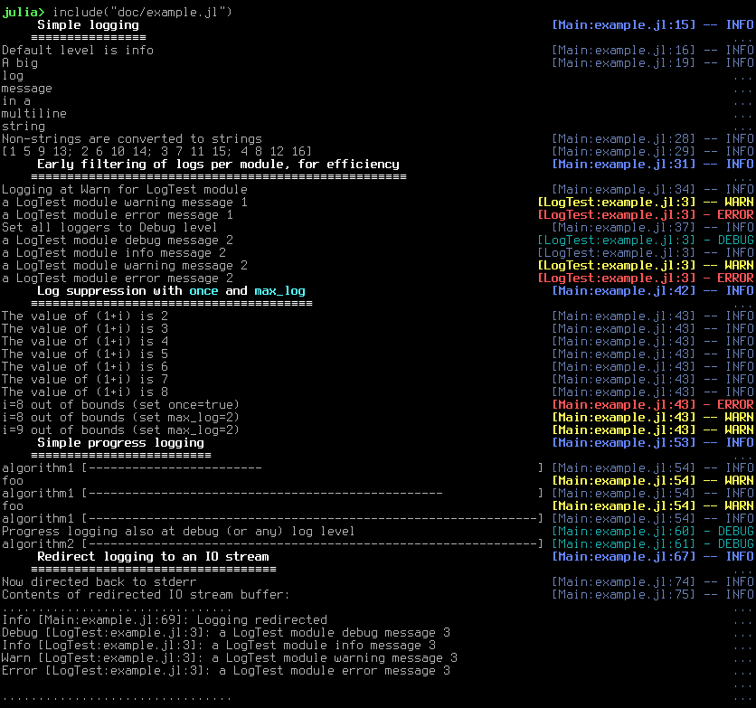

# MicroLogging

[](https://travis-ci.org/c42f/MicroLogging.jl)

[](http://codecov.io/github/c42f/MicroLogging.jl?branch=master)

Logging should be useful and pleasant for the average user and package
developer, but should meet the efficiency and flexibility demands of production
deployment.

MicroLogging is an implementation of the new logging interface introduced in
`Base` in julia-0.7, and brings most of same features to julia-0.6. See the
[**Base Documentation**](https://docs.julialang.org/en/v1/stdlib/Logging) for
an overview. It may also include experimental features which will one day make
it into the `Logging` standard library.

## Install

```julia
Pkg.add("MicroLogging")
```

## Quickstart Example

```julia
using MicroLogging

@info "# Logging macros"
@debug "A message for debugging (filtered out by default)"
@info "Information about normal program operation"
@warn "A potential problem was detected"
@error "Something definitely went wrong"
x = [1 2;3 4]
@info "Support for key value pairs" x a=1 b="asdf"

#-------------------------------------------------------------------------------
@info "# Progress logging"
for i=1:100
    sleep(0.01)
    @info "algorithm1" progress=i/100
end

#-------------------------------------------------------------------------------
@info "# Log record filtering"
@debug begin
    error("Should not be executed unless logging at debug level")
    "A message"
end
configure_logging(min_level=:debug)
@debug "Logging enabled at debug level and above"
for i=1:10
    @warn "Log suppression iteration $i (maxlog=2)" maxlog=2
end
module LogTest
    using MicroLogging
    function f()
        @debug "Message from LogTest"
        @info  "Message from LogTest"
        @warn  "Message from LogTest"
        @error "Message from LogTest"
    end
end
LogTest.f()
configure_logging(LogTest, min_level=:error)
@info "Set log filtering to error level for LogTest module"
LogTest.f()

#-------------------------------------------------------------------------------
@info "# Task-based log dispatch using dynamic scoping"
function some_operation()
    @info "Dispatches to the current task logger, or the global logger"
end
logstream = IOBuffer()
with_logger(SimpleLogger(logstream)) do
    @info "Logging redirected"
    some_operation()
end
@info "Logs, captured separately in the with_logger() block" logstring=strip(String(take!(logstream)))

#-------------------------------------------------------------------------------
@info "# Formatting logs can't crash the application"
@info "Blah $(error("An intentional error"))"

configure_logging(min_level=:info)
nothing
```

The script above produces console output like the following.
`InteractiveLogger` tries to put the metadata out of your way as much as
possible by placing it on the right hand of the terminal.



Notice that the message part of each log record is interpreted as markdown by
convention to allow for readable log formatting with various backends.  If you
want to transport data, you should send it through as a user defined key value
pair rather than interpolating it into the log message itself.


## MicroLogging implementation choices

### Early filtering

The filtering of log messages should cheap enough that users feel free to leave
them available rather than commenting them out or otherwise disabling them at
compile time. The only way to achieve this is to filter early, before the
entire log message and other log record metadata is fully determined. Thus, we
have the following design challenge:

> Allow early filtering of log records *before* the record is fully constructed.

In most logging libraries, a basic level of filtering is achieved based on an
ordered **log level** which represents a verbosity/severity (debug, info,
warning, error, etc).  Messages more verbose than the currently minimum level
are filtered out.  This seems simple, effective and efficient as a first pass
filter. Naturally, further filtering may also occur based on the log message or
other log record metadata.

In `MicroLogging`, early filtering can be controlled using the
`configure_logging` function, which configures filtering of the current logger:

```julia
configure_logging(min_level=:debug)
```

For even more efficiency, the `disable_logging()` function can be used to
globally disable logging below a given log for all loggers.

### Logging macros

Efficiency seems to dictate that some filtering decision is done *before* any
logging-specific user code is run. This implies either a logging macro to insert
an early test and branch, or that the log record creation is passed as a
closure. We'd also like to gather information from lexical scope, and to look
up/create the logger for the current module at compile time.

These considerations indicate that a macro be used, which also has the nice side
effect of being visually simple:

```julia
x = 42
@info "my value is x = $x"
```

To achieve early filtering, this example currently expands to something like

```julia
if Info >= MicroLogging._min_enabled_level[]
    logger = $(current_logger())
    if shouldlog(logger, Info)
        logmsg(current_logger(), Info, "my value is x = $x", #=...=#)
    end
end
```

### Logging context and dispatch

Every log record has various types of context which can be associated with it.
Some types of context include:

* static **lexical context** - based on the location in the code - local
  variables, line number, file, function, module.
* dynamic **caller context** - the current stack trace, and data visible in
  it. Consider, for example, the context which can be passed with the
  femtolisp `with-bindings` construct.
* dynamic **data context** - context created from data structures available at
  log record creation.

Log context can be used in two ways.  First, to dispatch the log record to
appropriate handler *code*.  Second, to enrich the log record with *data* about
the state of the program.

> Which code processes a log message after it is created?

Here we've got to choose between lexical vs dynamic scope to look up the log
handler code.  MicroLogging chooses a *dynamically scoped* log handler bound to
the current task.  To understand why this might be good choice, consider the two
audiences of a logging library:

* *Package authors* want to emit logs in a simple way, without caring about how
  they're dispatched.
* *Application authors* care about a complete application as built up from
  many packages. They need to control how log records are dispatched, but don't
  get any control over how they're created.

Application programmers tend to be calling functions from many different
packages to achieve an overall task. With dynamic scoping for log handlers, it's
easy to control log dispatch based on task:

```julia
logger = MyLogger(#= ... =#)

with_logger(logger) do
    Package1.foo()
    Package2.bar()
    Package2.baz()
end
```

Notably, this approach works no matter how deeply nested the call tree becomes
within the various functions called by `Package1.foo()`, without any thought by
the author of any of the packages in use.

Most logging libraries seem to look up the log handler in lexical scope, which
implies a global entry point for log dispatch.  For example, the python
community seems to have settled on using
[per-module contexts](https://docs.python.org/3/library/logging.html#logger-objects)
to dispatch log messages (TODO: double check how this works).

> Which metadata is automatically included with the log record?

Some useful metadata is automatically generated with each record:

* Module
* Location - file, line number
* `id` - a unique Symbol for the logger invocation


### Efficiency - messages you never see should cost almost nothing

The following should be fast

```julia
@debug begin
    A = #=Long, complex calculation=#
    "det(A) = $(det(A))"
end
```

... *FIXME* more to write here

